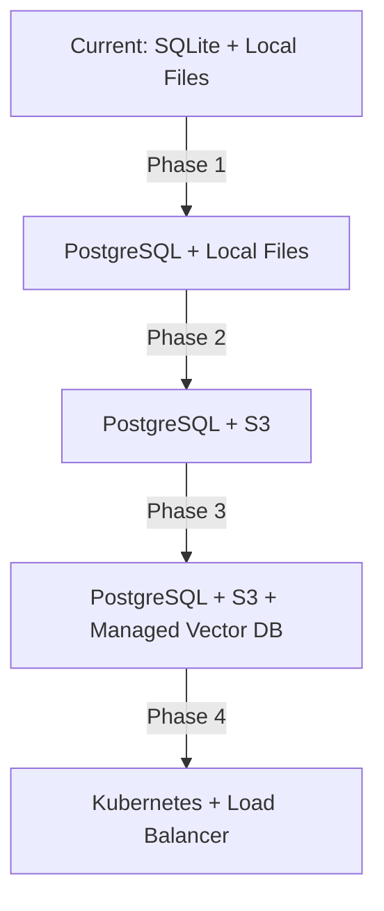

# DocuMind AI - Project Status & Roadmap

**Last Updated:** December 29, 2025  
**Version:** v1.0 (Single-User Production Ready)

---

## 🎯 Current Status Summary

### ✅ Completed Features

#### Core RAG System
- ✓ Automated file monitoring and processing
- ✓ Document chunking and vector embeddings (Sentence Transformers)
- ✓ ChromaDB integration for semantic search
- ✓ CrossEncoder re-ranking for improved accuracy
- ✓ Multi-language support (English + Hindi)
- ✓ Strict citation and source tracking
- ✓ File type support: PDF, DOCX, PPTX, TXT, MD, PY, JS, etc.

#### Authentication & Authorization
- ✓ JWT-based authentication system
- ✓ Role-Based Access Control (RBAC)
- ✓ User management (Create, Edit, Delete users)
- ✓ Role management (Create, Edit, Delete roles)
- ✓ **File-level permissions** (Domain-based access control)
- ✓ Password management (Change password functionality)
- ✓ Session management

#### File Access Control
- ✓ **12 Document Domains**:
  - Education, College, School
  - Technology, Code, Documentation
  - Healthcare, ResearchPaper
  - Company, Business, Finance, Legal
- ✓ Role-to-domain permission mapping
- ✓ Dynamic permission assignment via Admin Dashboard
- ✓ Access denied messages for unauthorized queries

#### Security & Ownership ✅
- ✓ **Strict File Ownership**: Users can only see/delete their own files
- ✓ **Admin Privileges**: Global delete access with wildcard permissions
- ✓ **Secure Deletion**: Ownership verification before execution
- ✓ **Path Security**: Cross-platform path normalization (Windows/Linux)

#### Admin Dashboard
- ✓ User Management UI
- ✓ Role Management UI with file permission controls
- ✓ User chat history viewer
- ✓ Protected Admin role (cannot be deleted/modified)
- ✓ Consistent UI styling across all pages

#### File Organization
- ✓ Autonomous file classification (AI-powered)
- ✓ Organized folder structure: `data/sorted/{Domain}/{Category}/{Extension}/{Year-Month}/`
- ✓ Duplicate file detection (SHA-256 hashing)
- ✓ Automatic categorization into 20+ categories

#### Database Architecture
- ✓ SQLite for user/role management (`data/users.db`)
- ✓ ChromaDB for vector storage
- ✓ Redis/Memurai for caching
- ✓ File metadata persistence

---

## 🚧 Pending Implementations

### High Priority

#### 1. **Database Consolidation** ✅
**Status:** Completed. `auth.db` has been removed and all data consolidated into `users.db`.

#### 2. **Debug Logging Cleanup** ✅
**Status:** Completed. 
- Verbose logs moved to `DEBUG` level.
- `LOG_LEVEL` configuration added to `config.py` (defaults to INFO).
- Critical logs retained at `INFO` level.

#### 3. **File Domain/Category Metadata Fix** ✅
**Status:** Completed.
- **Root Cause:** 
  1. `worker.py` was not updating `sorted_path` in `user_uploads`, causing files to be hidden from non-admin users.
  2. `app.py` `list_files` (Admin view) was failing to split paths correctly on Windows, showing "Unknown" domain.
- **Fixes Applied:**
  - Updated `worker.py` to sync `sorted_path` to SQLite after processing.
  - Updated `app.py` to normalize path separators before splitting.
  - Ran `sync_user_uploads.py` to fix existing records.
  - Verified ChromaDB metadata (found to be correct).

#### 4. **Performance Optimization** ✅
**Status:** Completed.
- **Implemented:**
  - **Database:** Enabled SQLite WAL mode (`scripts/optimize_db.py`) for high concurrency.
  - **Caching:** Added `@lru_cache` to `core/permissions.py` RBAC checks to eliminate N+1 query bottlenecks.
  - **Serving:** Installed `waitress` and created `serve.py` for production-grade threading.
  - **Access Control:** Updated `Student` and `Teacher` roles to include `Technology` domain access (fixing retrieval issues for crypto docs).

#### 5. **Restart Server**s)

---

## 🔮 Future Enhancements

### Short-term (1-2 weeks)

#### Analytics & Monitoring
- User activity tracking
- Query analytics dashboard
- Document access logs
- System health monitoring
- Performance metrics

#### UI/UX Improvements
- Search history for users
- Bookmarks/favorites system
- Advanced search filters
- Dark/light theme toggle
- Mobile-responsive design

#### Document Management
- Bulk file upload
- File versioning system
- Document expiry/archival
- Manual file categorization override
- File sharing between users

### Medium-term (1-2 months)

#### Advanced RBAC
- Time-based access (temporary permissions)
- Document-level permissions (individual files)
- Permission inheritance hierarchies
- Audit logs for access control changes
- Role templates/presets

#### Integration Features
- API webhooks for external systems
- SSO (Single Sign-On) integration
- LDAP/Active Directory support
- Slack/Teams bot integration
- Email notifications

#### AI Enhancements
- Custom LLM model support (beyond Ollama)
- Fine-tuning on domain-specific data
- Summarization features
- Question suggestion based on documents
- Multi-document comparison

---

## 🌐 Multi-User/Multi-Tenant Architecture

### Current Architecture (Single-User/Shared)
```
Current: All users share same document database
- All documents accessible to all users (filtered by RBAC)
- Single ChromaDB collection
- Shared file storage
```

### Target Architecture (Multi-Tenant)

#### Option 1: **Soft Multi-Tenancy** (Recommended for MVP)
**Description:** Share infrastructure, isolate via metadata

**Implementation:**
```python
# Add tenant_id to all data models
user = {
    'id': 1,
    'username': 'john@acme.com',
    'tenant_id': 'acme_corp',  # ← Organization/domain
    'role_id': 2
}

# Filter all queries by tenant
chunks = db.query(query, tenant_id=current_user.tenant_id)
```

**Changes Required:**
1. **Database Schema Updates:**
   ```sql
   ALTER TABLE users ADD COLUMN tenant_id TEXT;
   ALTER TABLE roles ADD COLUMN tenant_id TEXT;
   
   -- Add tenant management table
   CREATE TABLE tenants (
       id TEXT PRIMARY KEY,
       name TEXT NOT NULL,
       domain TEXT UNIQUE,  -- e.g., 'acme.com'
       created_at TIMESTAMP,
       max_users INTEGER DEFAULT 100,
       storage_limit_gb INTEGER DEFAULT 50
   );
   ```

2. **File Storage Isolation:**
   ```
   Current: data/sorted/{Domain}/...
   New:     data/tenants/{tenant_id}/sorted/{Domain}/...
   ```

3. **Vector DB Partitioning:**
   ```python
   # ChromaDB collections per tenant
   collection_name = f"docs_{tenant_id}"
   collection = client.get_or_create_collection(collection_name)
   ```

4. **Authentication Updates:**
   - Extract tenant from email domain (`user@acme.com` → `acme`)
   - Or manual tenant assignment during signup
   - Validate user belongs to tenant on login

5. **Admin Dashboard:**
   - Super Admin (cross-tenant)
   - Tenant Admin (within organization)
   - Tenant switcher for super admins

**Pros:**
- ✓ Easier to implement
- ✓ Shared infrastructure (cost-effective)
- ✓ Simpler maintenance

**Cons:**
- ✗ Potential performance impact with many tenants
- ✗ Security depends on correct filtering
- ✗ No true data isolation

---

#### Option 2: **Hard Multi-Tenancy** (Enterprise)
**Description:** Complete isolation - separate databases per tenant

**Implementation:**
```python
# Dynamic database selection
tenant_db = f"data/tenants/{tenant_id}/users.db"
tenant_vector_db = f"data/tenants/{tenant_id}/chroma_db"

auth_manager = AuthManager(tenant_db)
db_manager = VectorDB(tenant_vector_db)
```

**Changes Required:**
1. **Infrastructure:**
   - Separate SQLite DB per tenant
   - Separate ChromaDB instance per tenant
   - Separate Redis namespace per tenant
   - Separate file storage directories

2. **Connection Management:**
   ```python
   class TenantConnectionManager:
       def get_auth_manager(self, tenant_id):
           return AuthManager(f"data/tenants/{tenant_id}/users.db")
       
       def get_vector_db(self, tenant_id):
           return VectorDB(f"data/tenants/{tenant_id}/chroma_db")
   ```

3. **Tenant Management Service:**
   - Tenant provisioning (create all resources)
   - Tenant deprovisioning (cleanup)
   - Resource monitoring per tenant
   - Backup per tenant

**Pros:**
- ✓ Complete data isolation
- ✓ Better security
- ✓ Scalable (can move tenants to different servers)
- ✓ Easier compliance (data residency)

**Cons:**
- ✗ Complex implementation
- ✗ Higher resource usage
- ✗ More difficult maintenance
- ✗ Slower onboarding

---

### Recommended Roadmap: Multi-Tenant Implementation

#### Phase 1: Foundation (Week 1-2)
- [ ] Add `tenants` table to database
- [ ] Add `tenant_id` column to users/roles
- [ ] Update authentication to extract/assign tenant_id
- [ ] Create tenant management UI

#### Phase 2: Data Isolation (Week 3-4)
- [ ] Implement tenant-based file storage
- [ ] Create separate ChromaDB collections per tenant
- [ ] Add tenant filtering to all database queries
- [ ] Update file processor to respect tenant boundaries

#### Phase 3: Admin & Permissions (Week 5-6)
- [ ] Implement Super Admin role
- [ ] Create Tenant Admin role
- [ ] Build tenant management dashboard
- [ ] Add tenant-level permission controls

#### Phase 4: Testing & Migration (Week 7-8)
- [ ] Test multi-tenant isolation
- [ ] Load testing with multiple tenants
- [ ] Migrate existing data to tenant structure
- [ ] Documentation and deployment guides

---

## 🔐 Security Considerations for Multi-Tenancy

### Critical Requirements

1. **Tenant Isolation Validation**
   ```python
   # ALWAYS validate tenant ownership
   def get_document(doc_id, user):
       doc = db.get(doc_id)
       if doc.tenant_id != user.tenant_id:
           raise UnauthorizedError("Access denied")
       return doc
   ```

2. **Cross-Tenant Leakage Prevention**
   - Use parameterized queries with tenant filters
   - Implement middleware to auto-inject tenant_id
   - Regular security audits
   - Penetration testing

3. **Resource Quotas**
   ```python
   tenants = {
       'acme_corp': {
           'max_users': 100,
           'storage_gb': 50,
           'max_queries_per_day': 10000
       }
   }
   ```

4. **Rate Limiting**
   - Per-tenant API rate limits
   - Document upload limits
   - Query throttling

---

## 📊 Scalability Considerations

### Current Bottlenecks

1. **SQLite Limitations**
   - Single-writer bottleneck
   - Not ideal for high concurrency
   - **Recommendation:** Migrate to PostgreSQL for production

2. **File System Storage**
   - Local disk space constraints
   - No redundancy
   - **Recommendation:** Move to S3/MinIO for object storage

3. **Vector Database**
   - In-memory ChromaDB limitations
   - **Recommendation:** Consider Pinecone, Weaviate, or Qdrant for scale

### Migration Path to Production-Ready Multi-Tenant



#### Phase 1: Database Migration
- SQLite → PostgreSQL
- Connection pooling (pgBouncer)
- Read replicas for analytics

#### Phase 2: Object Storage
- Local files → S3/MinIO
- Pre-signed URLs for file access
- CDN for static assets

#### Phase 3: Vector Database
- ChromaDB → Pinecone/Weaviate
- Separate indexes per tenant
- Auto-scaling support

#### Phase 4: Infrastructure
- Docker containers
- Kubernetes orchestration
- Horizontal pod autoscaling
- Redis cluster for caching
- Load balancer (nginx/HAProxy)

---

## 🎯 Immediate Next Steps (Priority Order)

### Before Multi-Tenant Implementation

1. **Clean Up Database Issues** (1-2 days)
   - Remove `auth.db` references
   - Consolidate to `users.db`
   - Fix domain/category metadata

2. **Reduce Debug Logging** (1 day)
   - Configure log levels
   - Clean up verbose logs

3. **Performance Baseline** (2 days)
   - Load testing current system
   - Identify bottlenecks
   - Establish metrics

4. **Documentation** (2 days)
   - API documentation
   - Deployment guide
   - User manual

### For Multi-Tenant Implementation

5. **Design Document** (3 days)
   - Detailed architecture diagrams
   - Database schema design
   - API contract changes
   - Migration strategy

6. **Prototype** (1 week)
   - Implement soft multi-tenancy
   - 2-3 test tenants
   - Validate isolation

7. **Full Implementation** (4-6 weeks)
   - Follow roadmap above
   - Incremental rollout
   - Continuous testing

---

## 📝 Notes

### Known Issues
- ✓ Dual database issue (auth.db vs users.db) - **Workaround in place**
- ✓ File domain metadata set to "Unknown" - **Workaround in place**
- ⚠️ Excessive database connections during RBAC checks - **Needs optimization**
- ⚠️ No connection pooling - **Future enhancement**

### Testing Coverage
- ✓ Manual testing of RBAC
- ✓ File upload/processing verified
- ✓ Admin dashboard functional
- ✗ Automated unit tests - **Not implemented**
- ✗ Integration tests - **Not implemented**
- ✗ Load testing - **Not performed**

### Dependencies
- Python 3.12
- Ollama (llama3.2 model)
- Redis/Memurai
- ChromaDB
- Sentence Transformers
- SQLite (current) / PostgreSQL (future)

---

## ✅ Summary

**Current State:** Production-ready for **single organization** with multiple users and role-based file access control.

**Readiness for Multi-User (Domain-Based):**
- ✓ Core infrastructure supports it
- ✓ RBAC system in place
- ⚠️ Needs tenant isolation layer
- ⚠️ Requires database refactoring

**Estimated Timeline for Multi-Tenant Support:**
- **MVP (Soft Multi-Tenancy):** 4-6 weeks
- **Production (Hard Multi-Tenancy):** 8-12 weeks

**Recommended Approach:** Start with soft multi-tenancy, migrate to hard multi-tenancy as you scale.

---

*End of Document*
