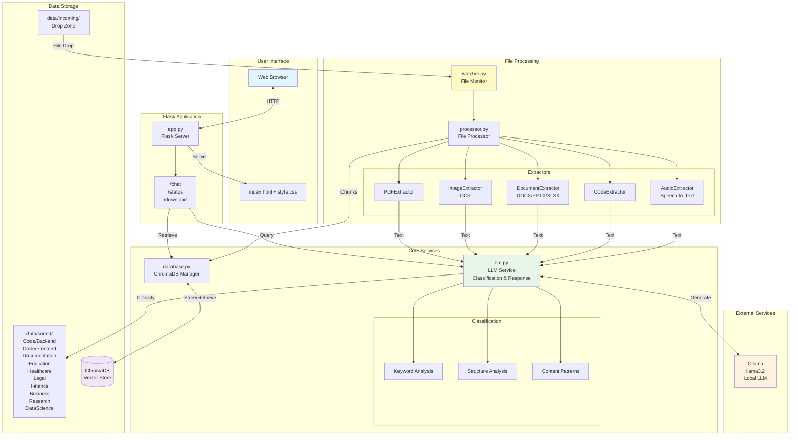
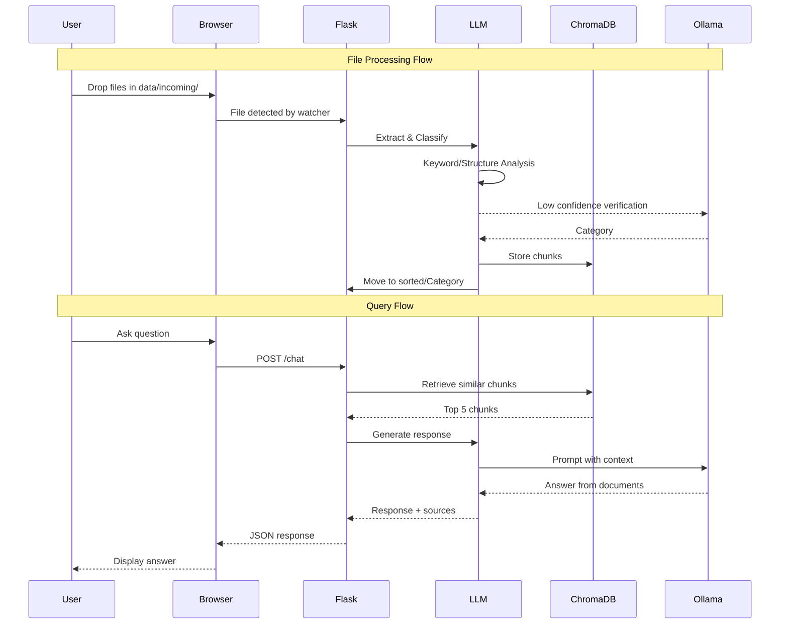
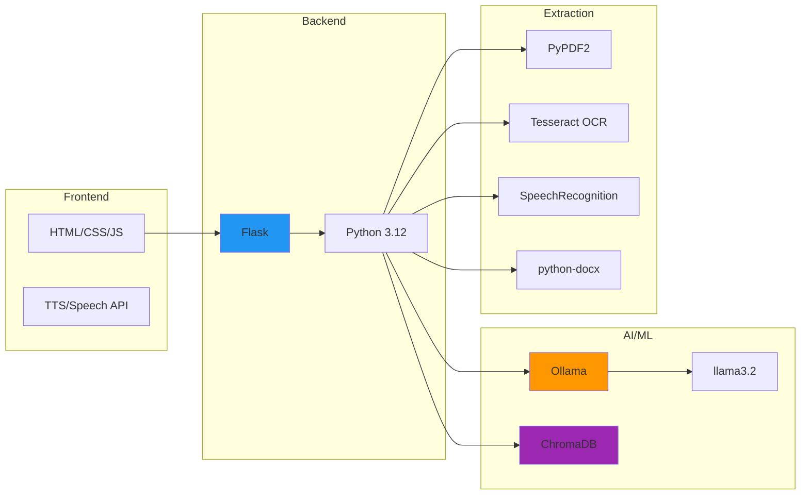

# DocuMind AI - Project Architecture

```mermaid
flowchart TB
    subgraph User Interface
        Browser[Web Browser]
        UI[index.html + style.css]
    end
    
    subgraph Flask Application
        App[app.py<br/>Flask Server]
        Routes["/chat<br/>/status<br/>/download"]
    end
    
    subgraph File Processing
        Watcher[watcher.py<br/>File Monitor]
        Processor[processor.py<br/>File Processor]
        
        subgraph Extractors
            PDF[PDFExtractor]
            Image[ImageExtractor<br/>OCR]
            Doc[DocumentExtractor<br/>DOCX/PPTX/XLSX]
            Code[CodeExtractor]
            Audio[AudioExtractor<br/>Speech-to-Text]
        end
    end
    
    subgraph Core Services
        LLM[llm.py<br/>LLM Service<br/>Classification & Response]
        DB[database.py<br/>ChromaDB Manager]
        
        subgraph Classification
            Keywords[Keyword Analysis]
            Structure[Structure Analysis]
            Content[Content Patterns]
        end
    end
    
    subgraph Data Storage
        Incoming[data/incoming/<br/>Drop Zone]
        Sorted[data/sorted/<br/>Code/Backend<br/>Code/Frontend<br/>Documentation<br/>Education<br/>Healthcare<br/>Legal<br/>Finance<br/>Business<br/>Research<br/>DataScience]
        ChromaDB[(ChromaDB<br/>Vector Store)]
    end
    
    subgraph External Services
        Ollama[Ollama<br/>llama3.2<br/>Local LLM]
    end
    
    Browser <-->|HTTP| App
    App --> Routes
    Routes -->|Query| LLM
    Routes -->|Retrieve| DB
    
    Incoming -->|File Drop| Watcher
    Watcher --> Processor
    Processor --> PDF & Image & Doc & Code & Audio
    
    PDF & Image & Doc & Code & Audio -->|Text| LLM
    LLM --> Keywords & Structure & Content
    LLM -->|Classify| Sorted
    
    Processor -->|Chunks| DB
    DB <-->|Store/Retrieve| ChromaDB
    
    LLM <-->|Generate| Ollama
    
    App -->|Serve| UI
    
    style Browser fill:#e1f5ff
    style Ollama fill:#fff3e0
    style ChromaDB fill:#f3e5f5
    style LLM fill:#e8f5e9
    style Watcher fill:#fff9c4
```

## System Flow

```mermaid
sequenceDiagram
    participant User
    participant Browser
    participant Flask
    participant LLM
    participant ChromaDB
    participant Ollama
    
    Note over User,Ollama: File Processing Flow
    User->>Browser: Drop files in data/incoming/
    Browser->>Flask: File detected by watcher
    Flask->>LLM: Extract & Classify
    LLM->>LLM: Keyword/Structure Analysis
    LLM-->>Ollama: Low confidence verification
    Ollama-->>LLM: Category
    LLM->>ChromaDB: Store chunks
    LLM->>Flask: Move to sorted/Category
    
    Note over User,Ollama: Query Flow
    User->>Browser: Ask question
    Browser->>Flask: POST /chat
    Flask->>ChromaDB: Retrieve similar chunks
    ChromaDB-->>Flask: Top 5 chunks
    Flask->>LLM: Generate response
    LLM->>Ollama: Prompt with context
    Ollama-->>LLM: Answer from documents
    LLM-->>Flask: Response + sources
    Flask-->>Browser: JSON response
    Browser-->>User: Display answer
```

## Technology Stack

```mermaid
graph LR
    subgraph Frontend
        A[HTML/CSS/JS]
        B[TTS/Speech API]
    end
    
    subgraph Backend
        C[Flask]
        D[Python 3.12]
    end
    
    subgraph AI/ML
        E[Ollama]
        F[llama3.2]
        G[ChromaDB]
    end
    
    subgraph Extraction
        H[PyPDF2]
        I[Tesseract OCR]
        J[SpeechRecognition]
        K[python-docx]
    end
    
    A --> C
    C --> D
    D --> E & G
    E --> F
    D --> H & I & J & K
    
    style E fill:#ff9800
    style G fill:#9c27b0
    style C fill:#2196f3
```
